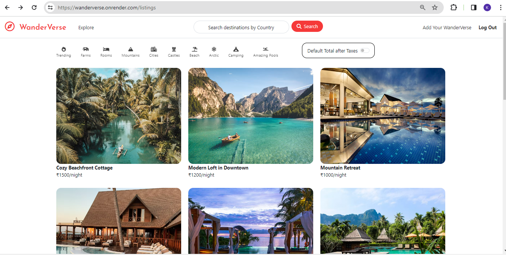
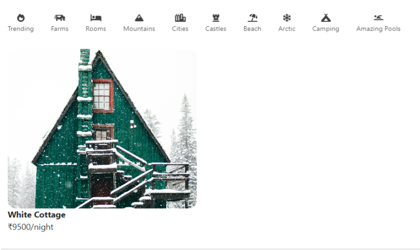
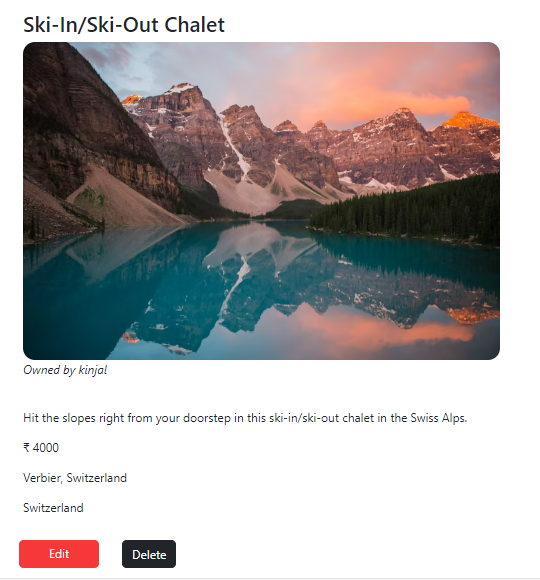
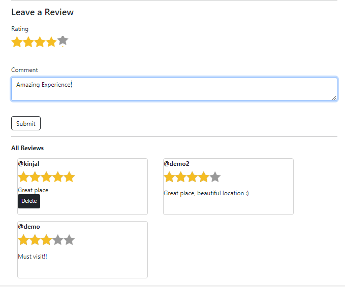
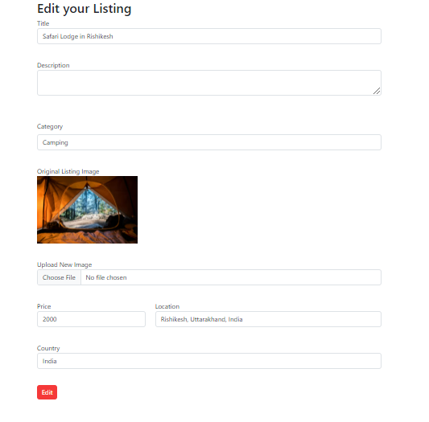
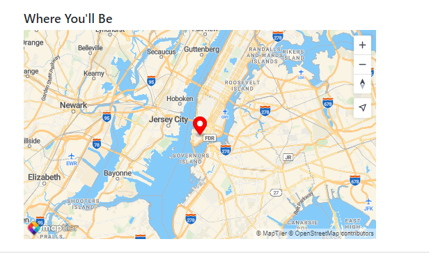

# WanderVerse
WanderVerse is a platform designed to connect travelers with unique and memorable accommodations around the world. Our goal is to make traveling more accessible and enjoyable for everyone.

> A brief description of WanderVerse.
## Table of Contents
- [Features](#features)
- [Technologies Used](#technologies-used)
- [Website](#website)
- [Contact](#contact)
- [Acknowledgements](#acknowledgements)

## Features

- List your hotels/property and share your unique travel experience with the world.
- Discover new destinations and accommodations tailored to your preferences.
- Write a Review for the listed accomodations.
- Filter hotels and resorts on the basis of categories.
- Country-wise search for accomodations.

## Technologies Used

- **Frontend**: Javascript, EJS, CSS
- **Backend**: Node.js, Express
- **Database**: MongoDB Atlas
- **User Authentication and Authorization**: Passport
- **Session Management**: express-session
- **Schema Validations**: Joi
- **Map Location Display**: Maptiler
- **Flash messages**: connect-flash
- **Styling**: Bootstrap, Font awesome
- **Cloud Service for storing images**: Cloudinary
- **Deployment**: Render

## Website

Link: [https://wanderverse.onrender.com/listings](https://wanderverse.onrender.com/listings)

### Home Page

### Filter by Category

### View Accommodations

### Review Accommodations

### Edit Your Listing

### Locate the Place on Map

 />

## Contact

Kinjal Gupta-  kinjal150922@gmail.com

Project Link: [https://github.com/kinjal-1007/WanderVerse](https://github.com/kinjal-1007/WanderVerse)

## Acknowledgements

- [Font Awesome](https://fontawesome.com)
- [rating.css](https://github.com/LunarLogic/starability/blob/master/starability-css/starability-slot.css)

